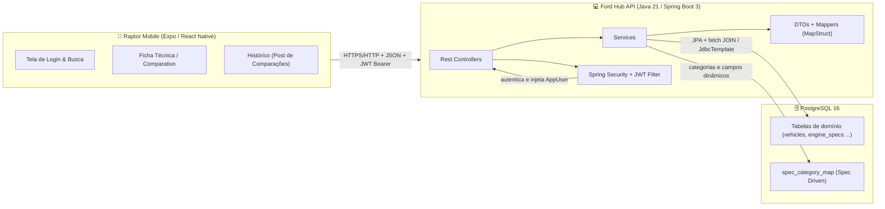
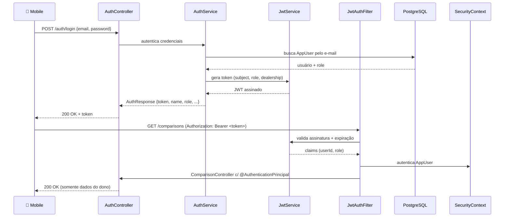

# Raptor Intelligence API (Ford Hub) 🦖

A **Raptor Intelligence API** é o backend oficial (escrito em Java e Spring Boot) que alimenta o aplicativo móvel **Raptor Intelligence**. Este sistema faz parte de uma solução de inteligência competitiva projetada para transformar a jornada de vendas dos consultores da Ford no Brasil.

## 🎯 Objetivo do Projeto

O objetivo principal desta API é fornecer dados técnicos precisos, estruturados e facilmente comparáveis de veículos (tanto da Ford, com destaque para a Ranger Raptor, quanto de seus concorrentes). A API gerencia a autenticação, o catálogo de veículos, as especificações organizadas por categorias dinâmicas e o histórico de comparações do consultor.

A arquitetura é escalável e **Spec Driven Development**: o comparativo `/compare` é montado dinamicamente a partir da tabela `spec_category_map`, permitindo adicionar categorias e especificações puramente via banco de dados, sem novo deploy.

## 🛠️ Stack Tecnológico

- **Linguagem:** Java 21
- **Framework:** Spring Boot 3.x
- **Banco de Dados:** PostgreSQL 16
- **Autenticação:** JWT (JSON Web Tokens) & Spring Security
- **Mapeamento de DTOs:** MapStruct
- **Validações:** Jakarta Validation
- **Boilerplate:** Lombok
- **Documentação da API:** Swagger/OpenAPI (springdoc) — UI em `/swagger-ui.html`

## 🚀 Como Executar o Projeto

Pré-requisitos: **Java 21**, **Maven** (ou o wrapper incluído) e **Docker** (PostgreSQL).

### Passo 1: Iniciar o Banco de Dados

Na **raiz do repositório** (um nível acima de `ford-hub`):

```bash
docker-compose up -d db
```

O arquivo `docker-compose.yml` sobe o PostgreSQL e executa automaticamente o `schema.sql` (que cria todas as tabelas **e popula os dados**).

> ⚠️ Após qualquer alteração no `schema.sql`, recrie o volume para o banco dev aplicar o novo schema:
> ```bash
> docker-compose down -v && docker-compose up -d db
> ```

### Passo 2: Executar a API Localmente

Na pasta `ford-hub`:

- **Linux/Mac:** `./mvnw spring-boot:run`
- **Windows:** `mvnw.cmd spring-boot:run`

A aplicação ficará disponível em `http://localhost:8080`.

O JWT usa um segredo e uma expiração configuráveis por ambiente:

```env
JWT_SECRET=segredo-com-mais-de-32-caracteres
JWT_EXPIRATION=86400000   # ms (padrão: 24h)
```

---

## 🔐 Autenticação e Autorização

O fluxo de autenticação usa **JWT Bearer**:

| Campos | Descrição |
|---|---|
| `POST /auth/login` | Recebe `{ "email", "password" }`, devolve `{ token, tokenType: "Bearer", expiresIn, name, dealership, role }` |
| `POST /auth/me` | Retorna os dados do usuário autenticado (enviar `Authorization: Bearer <token>`) |

**Usuários seed** (criados automaticamente na subida):

| Email | Senha | Role | Perfil |
|---|---|---|---|
| `admin@ford.com.br` | `password` | `CONSULTOR` | Consultor Teste (Ford Matriz) |
| `admin@raptor.com.br` | `admin123` | `ADMIN` | Administrador Sistema (Ford HQ) |

**Regras de segurança** (Spring Security + Metodologia Method Security):

| Recurso | Acesso |
|---|---|
| `GET /vehicles/**`, `GET /brands/**`, `GET /compare/**`, `/profiles/**`, `/swagger-ui/**` | **Público** (sem token) |
| `POST /auth/**` | **Público** (login) |
| `POST` / `DELETE` `/vehicles/**` | **Somente `ADMIN`** (sem token → `401`; token sem papel → `403`) |
| `/comparisons/**` | **Qualquer usuário autenticado**, com **posse de dados**: 403 se a comparação não pertence ao usuário |

**Contrato de erros** (JSON padrão): `400` validação/parâmetro ausente · `401` credenciais/token inválido · `403` sem permissão/posse · `404` recurso inexistente · `500` erro inesperado (sem vazar detalhes internos).

---

## 📚 Endpoints

### Autenticação (`/auth`)
- `POST /auth/login` — autentica e retorna o JWT.
- `POST /auth/me` — dados do usuário autenticado.

### Veículos (`/vehicles`)
- `GET /vehicles` — lista resumo (id, marca, modelo, versão, ano, combustível, categoria, imagem, isReference).
- `GET /vehicles/{id}` — detalhe completo (specs, motor, transmissão, medidas, features).
- `POST /vehicles` — (ADMIN) cria veículo. Body: `{ brandId, model, version, modelYear, fuelType, category, isReference, imageUrl }`.
- `DELETE /vehicles/{id}` — (ADMIN) exclui veículo.

### Marcas (`/brands`)
- `GET /brands` — lista as marcas do catálogo.

### Comparativo dinâmico (`/compare` ⭐ núcleo do projeto)
- `GET /compare?ids=1,2,3&categories=motor,desempenho` — monta o quadro comparativo com base em `spec_category_map`. `ids` é obrigatório (400 se ausente, 404 se algum id não existe); `categories` filtra/bloqueia a resposta.

### Histórico de comparações (`/comparisons`)
- `GET /comparisons` — lista as comparações do usuário autenticado.
- `POST /comparisons` — salva `{ vehicleAId, vehicleBId, notes? }`.
- `DELETE /comparisons/{id}` — remove (403 se não for do próprio usuário).

### Perfil do Cliente (`/profiles`)
- `GET /profiles/{type}` — perfil por tipo (`enthusiast` | `lifestyle` | `rational` | `tech`) com descrição, sinais de detecção e argumentos de venda.
- `POST /profiles/detect` — recebe `{ brand, model, version, attributes[] }` e detecta o perfil por palavras-chave gravadas no banco (`profile_detection_keywords`); sem correspondência retorna `tech`.
  - Exemplo: `{ "brand": "Ford", "model": "Ranger", "version": "Raptor" }` → `enthusiast` (Entusiasta Off-Road) com 3 argumentos de venda.

> A documentação OpenAPI completa (schemas, segurança e exemplos) está disponível em `http://localhost:8080/swagger-ui.html`.

---

## 🧪 Testes

A suíte usa **Testcontainers** com **PostgreSQL real** (mesmo `schema.sql` do ambiente de dev, copiado para `src/test/resources`).

```bash
./mvnw test        # Linux/Mac
mvnw.cmd test      # Windows
mvnw.cmd verify    # gera o relatório de cobertura em target/site/jacoco/index.html
```

Cenários cobertos (32 testes): login com sucesso e com senha inválida; contexto do usuário (`/auth/me`); geração/validação e expiração de JWT; `GET /vehicles`; referência `isReference`; criação/exclusão de veículo (sem token → 401, consultor → 403, admin → 201/204); `GET /vehicles/{id}` com id inválido → 400; comparativo com ids ausentes → 400 e com ids inexistentes → 404; salvar comparação com veículo inexistente → 404; listar/excluir comparações e posse de dados (403 para comparação alheia); detecção de perfil do cliente (`/profiles/detect` → `enthusiast` para Ranger, `tech` default) e `GET /profiles/{type}` (200 com argumentos, 404 para tipo inexistente).

A cobertura é medida com o plugin **JaCoCo** (relatório gerado em `target/site/jacoco/` na fase `verify`).

---

## 🏗️ Arquitetura (visão geral)

### Diagrama de componentes



### Fluxo de autenticação (JWT)



### Fluxo interno das camadas

```
Controller → Service → Repository → PostgreSQL
      └── DTOs de request/response + MapStruct (nunca expõe entidades JPA)
      └── Tratamento global de erros (400/401/403/404/500)
GET /vehicles      → VehicleService.findById  → VehicleRepository (fetch JOIN)
GET /compare?ids=1 → CompareService.buildSheet → SpecCategoryMap + reflection
GET /comparisons   → ComparisonService.findByUser → ComparisonRepository (posse)
POST /profiles/detect → ProfileService.detect → KeywordRepository (score) → ProfileRepository
```

### Responsabilidade por pacote

| Pacote | Responsabilidade |
|---|---|
| `controller` | Camada Web/REST: endpoints, status codes, `@PreAuthorize` e anotações OpenAPI |
| `service` | Regras de negócio e orquestração; transações; posse de dados em comparações |
| `repository` | Acesso a dados (Spring Data JPA), queries com `fetch JOIN` para evitar N+1 |
| `mapper` | Conversão Entidade → DTO/Response (MapStruct) |
| `dto` (request/response) | Contratos de entrada (com Bean Validation) e saída, agnósticos ao modelo JPA |
| `model` | Entidades JPA alinhadas ao `schema.sql`; enums `FuelType`, `VehicleCategory`, `UserRole` |
| `exception` | Erros de domínio (`ResourceNotFoundException`, `UnauthorizedException`) + `GlobalExceptionHandler` |
| `security` | `JwtService`, `JwtAuthFilter`, entry point (401) e access denied handler (403) |
| `config` | `SecurityConfig`, `OpenAPIConfig`, `CorsConfig`, `DataInitializer` (seed) |

### Spec Driven Development

O comparativo `/compare` é **montado dinamicamente**: as categorias e os campos exibidos são
lidos da tabela `spec_category_map`, e os valores são extraídos por *reflection* das entidades
(`engineSpecs`, `drivetrainSpecs`, `suspensionSpecs`, `dimensions`, `warranty`). Isso permite
adicionar uma nova categoria/spec **apenas via banco de dados, sem novo deploy** da aplicação.

As entidades `Vehicle`, `EngineSpecs`, `DrivetrainSpecs`, `SuspensionSpecs`, `Dimensions`, `Warranty` e `Feature`
seguem as tabelas do `schema.sql`, e o `VehicleDetailResponse` agrega o veículo + specs para uso no app.

---

## 📱 Executando em Conjunto com o `raptor-mobile`

Por padrão, o aplicativo móvel **Raptor Mobile** (Expo/React Native) consome esta **API real** (mocks apenas com `EXPO_PUBLIC_USE_MOCKS=true`).

1. Certifique-se de que API + banco estão rodando.
2. Em `raptor-mobile`, crie/edite o `.env`:
   ```env
   EXPO_PUBLIC_USE_MOCKS=false
   EXPO_PUBLIC_API_URL=http://<SEU_ENDERECO_IP>:8080   # use o IP da sua máquina na rede (não localhost)
   EXPO_PUBLIC_DEV_EMAIL=admin@ford.com.br
   EXPO_PUBLIC_DEV_PASSWORD=password
   ```
3. Inicie: `npx expo start -c`

Ao logar com `admin@ford.com.br` / `password`, as requisições irão para o backend Java na porta 8080.